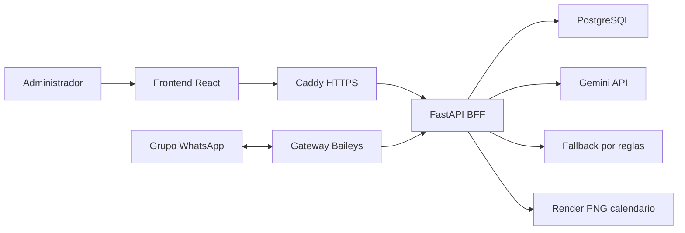

# Coordina

Bot y panel web que coordinan horarios de reuniones dentro de un grupo de WhatsApp (o Slack). El
bot lee los mensajes del grupo, un LLM extrae quién puede y cuándo, y un motor determinista en
Python calcula las mejores opciones de horario y responde con texto y, opcionalmente, una imagen
de calendario.

[](https://github.com/MatiasHernandezC/CoordAgent/actions/workflows/ci.yml)


## Qué hace

- Escucha un grupo de WhatsApp (Baileys) o un canal de Slack y detecta mensajes de coordinación.
- Un LLM (Gemini `gemini-2.5-flash-lite`, con cache, cooldown y fallback por reglas) extrae
  disponibilidad, remociones y correcciones de cada mensaje y devuelve JSON estructurado.
- Un motor Python determinista cruza esa disponibilidad, calcula cobertura contra el padrón real
  del grupo y rankea las mejores opciones de horario.
- El administrador confirma desde WhatsApp o desde el panel web; la decisión queda con
  trazabilidad (origen, autor, snapshot) y exporta reporte, link de calendario y `.ics`.
- Integración opcional con Google Calendar para crear el evento real al confirmar.

## Con qué está construido

| Componente | Stack |
| --- | --- |
| Backend | Python 3.11, FastAPI, SQLAlchemy, PostgreSQL en producción / JSON en tests |
| Frontend | React 18, TypeScript, Vite |
| Gateway WhatsApp | Node.js, Baileys |
| IA | Gemini API (llamadas HTTP directas con `urllib`, sin SDK) |
| Infraestructura | Docker Compose, Caddy (HTTPS/TLS automático) |

## Arquitectura



Más detalle: [coordinador-simple-mvp/docs/ARQUITECTURA.md](coordinador-simple-mvp/docs/ARQUITECTURA.md).

## Decisiones de arquitectura

- **El LLM solo extrae, nunca decide.** Gemini interpreta el mensaje y devuelve JSON
  (participantes, rangos horarios, remociones). Cuál es el mejor horario lo calcula un motor
  determinista en Python (`decision_engine.py`), para que el resultado sea reproducible, testeable
  sin llamar a un LLM y explicable ante el usuario.

- **Recuperación estructurada sobre el historial en vez de una base de datos vectorial.** El
  dominio es pequeño y tipado (roster, alias, decisiones previas de un grupo), así que antes de
  llamar al LLM se recupera ese contexto desde el propio almacén de sesiones y se agrega al
  prompt — sin embeddings ni vector DB. Sobre un dominio así, una moda determinista de las
  decisiones previas da precisión exacta donde una búsqueda por similitud solo daría una
  aproximación. Es una decisión de diseño explícita, no una carencia por resolver más adelante.

- **`urllib` de la stdlib en vez del SDK de Gemini.** El uso real es un puñado de llamadas HTTP
  (`generateContent` / `streamGenerateContent`) con streaming, reintentos y parseo de JSON
  propios. Evitar el SDK evita una dependencia adicional y su ciclo de versiones para algo que la
  librería estándar ya resuelve.

- **Idempotencia por `message_id` de WhatsApp.** El gateway persiste una cola de mensajes
  pendientes y deduplica por el id que entrega Baileys, así una reconexión o un reintento de red
  no vuelve a procesar (ni a duplicar una decisión ya tomada por) el mismo mensaje.

- **La cobertura se calcula contra el padrón real del grupo, no contra quienes respondieron.** El
  motor usa el máximo entre los participantes con datos y el conteo de miembros real del grupo de
  WhatsApp, para que "100% de cobertura" signifique que coordinó todo el grupo y no solo quienes
  alcanzaron a escribir.

## Deuda técnica consciente

- **Auth HTTP Basic en cada request.** La API valida usuario/clave con PBKDF2-SHA256 de 600.000
  iteraciones en cada llamada (~200-400 ms de CPU), lo que además abre un vector de denegación de
  servicio por consumo de CPU. El rate limiter (`RATE_LIMIT_*`, ver `.env.prod.example`) contiene
  el problema parcialmente al limitar intentos por IP/minuto, pero la solución correcta es emitir
  un token de sesión firmado tras el login y dejar de recalcular el hash en cada request.

## Ejecutar y probar

Guía completa (setup local, Docker, producción, variables de entorno):
[coordinador-simple-mvp/README.md](coordinador-simple-mvp/README.md).

Tests, en Linux/macOS/Windows:

```bash
cd coordinador-simple-mvp/backend
python3 -m venv .venv && source .venv/bin/activate   # Windows: .venv\Scripts\activate
pip install -r requirements.txt
DB_BACKEND=json LLM_PROVIDER=mock python -m pytest -q   # 382 passed

cd ../gateway && npm ci && node --test                  # 28 passed
cd ../frontend && npm ci && npm run build
```

## Documentación

- [Arquitectura](coordinador-simple-mvp/docs/ARQUITECTURA.md)
- [Configuración del LLM](coordinador-simple-mvp/docs/CONFIGURACION_LLM.md)
- [Despliegue WhatsApp](coordinador-simple-mvp/docs/DESPLIEGUE_WHATSAPP.md)
- [Despliegue Slack](coordinador-simple-mvp/docs/DESPLIEGUE_SLACK.md)
- [Operación en producción](coordinador-simple-mvp/docs/OPERACION_PRODUCCION.md)
- [Respaldo y recuperación](coordinador-simple-mvp/docs/BACKUP_RECOVERY.md)
