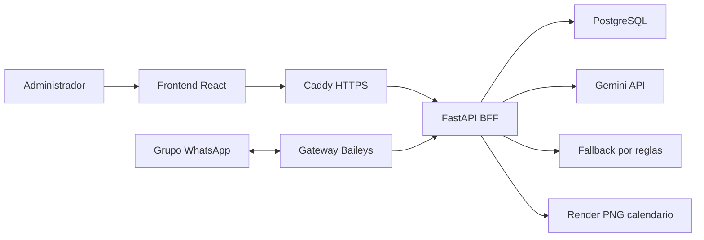

# Coordina WhatsApp MVP

Panel y bot liviano para coordinar horarios desde grupos de WhatsApp. El sistema
escucha mensajes del grupo, extrae disponibilidad con un LLM, calcula las mejores
opciones y responde con texto y, opcionalmente, una imagen/calendario.

Estado actual del MVP:

1. Panel web React para administrar sesiones y grupos.
2. Registro de cuentas y dos roles separados: administrador de plataforma y administrador propietario de grupos.
3. Backend FastAPI con repositorio PostgreSQL en produccion y JSON para tests.
4. Gateway WhatsApp basado en Baileys, con una sesion automatica por grupo.
5. Gemini `gemini-2.5-flash-lite` como extractor principal, con cache, cooldown y fallback por reglas.
6. Motor Python que calcula matriz de disponibilidad, cobertura y mejores horarios.
7. Respuesta configurable: solo texto, solo imagen o texto + imagen.
8. Comandos operativos desde WhatsApp para confirmar, exportar, revisar pendientes y corregir participantes.
9. Panel con trazabilidad de procesamiento, historial de decisiones y reporte descargable.
10. Cola persistente e idempotencia por ID de WhatsApp para reintentar sin duplicar decisiones.
11. Healthchecks, rotacion de logs, respaldo cifrado y monitor systemd del droplet.
12. Canal Slack opcional (ademas de WhatsApp), reutilizando el mismo pipeline de extraccion/decision. Ver [docs/DESPLIEGUE_SLACK.md](docs/DESPLIEGUE_SLACK.md).
13. Integracion opcional con Google Calendar: al confirmar, crea el evento real en la cuenta conectada (ademas del link/.ics de siempre). Ver [docs/CONFIGURACION_GOOGLE_CALENDAR.md](docs/CONFIGURACION_GOOGLE_CALENDAR.md).

## Roles y propiedad de grupos

- `platform_admin`: administra IA/Gemini, integraciones, usuarios, operación y todos los grupos.
- `group_admin`: se registra desde el frontend, crea sus grupos y solo puede administrar los grupos de su propiedad.
- Un grupo creado por `group_admin` entrega un código de un solo uso. Después de agregar manualmente el bot al grupo de WhatsApp, el propietario envía `@coordina vincular CODIGO` dentro del grupo.
- El código se invalida al vincularse; un grupo no puede ser reclamado por dos cuentas.

## Mejoras Operativas

Comandos soportados en grupos:

```txt
@coordina
@coordina confirmar 1
@coordina faltan
@coordina exportar
@coordina quitar Ana
@coordina reinicia historial
@coordina requerido @Ana          (solo admins del grupo)
@coordina prioridad @Ana 3        (solo admins del grupo)
@coordina normal @Ana             (solo admins del grupo)
```

Los tres ultimos configuran participantes **requeridos** (deben estar si o si)
y **pesos de prioridad** (ej. el jefe); el motor determinista pondera el score y
filtra opciones que dejen fuera a un requerido. Solo responden a las personas
administradoras del grupo (`coordinator_ids`).

El backend distingue estos comandos antes de llamar al LLM. Asi se ahorran tokens
y se evitan efectos raros cuando el administrador solo quiere cerrar una opcion
o pedir un reporte. Cada confirmacion queda guardada en `decision_history` con
origen (`panel`, `whatsapp` o `api`), autor y snapshot de la opcion elegida.

`@coordina reinicia historial` inicia una coordinacion nueva dentro del mismo
grupo. Limpia el estado activo (participantes, disponibilidades, opciones y
decision), conserva el historial previo para auditoria y crea un limite para que
el extractor no vuelva a usar mensajes de la ronda anterior.

Cada extraccion tambien guarda `last_processing`, un resumen liviano con fuente,
confianza, cache/fallback y cantidad de participantes/remociones detectadas. Esto
ayuda a saber si una respuesta vino de Gemini, cache o reglas de respaldo.

La sesion ademas calcula un **horario habitual** desde `decision_history`: cuando
alguien escribe "a la hora de siempre", el backend lo reescribe con ese slot
literal antes del extractor (ver `docs/ARQUITECTURA.md`). La trazabilidad marca
`habitual_used` cuando se resolvio con memoria.

## Arquitectura Rapida



Mas detalle: [docs/ARQUITECTURA.md](docs/ARQUITECTURA.md).

## Carpetas

```txt
coordinador-simple-mvp/
+-- backend/       FastAPI, servicios, schemas, repositorios y tests
+-- frontend/      React + TypeScript, panel administrativo
+-- gateway/       Cliente WhatsApp/Baileys
+-- docs/          Arquitectura, despliegue y configuracion LLM
+-- Caddyfile      HTTPS, headers y proxy del dominio publico
+-- docker-compose.prod.yml
```

## Ejecutar Local

Backend:

Windows (PowerShell):

```powershell
cd backend
py -3.11 -m venv .venv
.\.venv\Scripts\python.exe -m pip install -r requirements.txt
$env:DB_BACKEND="json"
$env:LLM_PROVIDER="mock"
.\.venv\Scripts\python.exe -m uvicorn app.main:app --reload --port 8000
```

Linux/macOS:

```bash
cd backend
python3.11 -m venv .venv
source .venv/bin/activate
pip install -r requirements.txt
DB_BACKEND=json LLM_PROVIDER=mock python -m uvicorn app.main:app --reload --port 8000
```

Frontend:

```bash
cd frontend
npm install
npm run dev
```

URLs locales:

```txt
Frontend: http://127.0.0.1:5173
Backend:  http://127.0.0.1:8000
Health:   http://127.0.0.1:8000/health
Runtime:  http://127.0.0.1:8000/api/runtime
```

Docker local:

```powershell
docker compose up --build
```

## Produccion

Produccion usa `docker-compose.prod.yml`:

- `caddy`: publica 80/443, TLS automatico y headers de seguridad.
- `frontend`: build estatico servido por nginx interno.
- `backend`: FastAPI sin puerto publico directo.
- `db`: PostgreSQL privado en la red Docker.
- `gateway`: WhatsApp/Baileys con credenciales persistidas en volumen `waauth`.

Guias:

- [Despliegue WhatsApp](docs/DESPLIEGUE_WHATSAPP.md)
- [Operacion de produccion](docs/OPERACION_PRODUCCION.md)
- [Respaldo y recuperacion](docs/BACKUP_RECOVERY.md)

Variables clave de `.env.prod`:

```txt
PUBLIC_DOMAIN=coordina.xshift007.com
PUBLIC_URL=https://coordina.xshift007.com
PANEL_ADMIN_USERNAME=admin
PANEL_ADMIN_PASSWORD=... # 12 caracteres o mas
GATEWAY_API_TOKEN=... # secreto diferente y aleatorio
POSTGRES_PASSWORD=...
LLM_PROVIDER=gemini
GEMINI_API_KEY=... # solo para la migracion inicial
LLM_KEYS_MASTER_KEY=... # 32 bytes aleatorios en base64
GEMINI_MODEL=gemini-2.5-flash-lite
TRIGGER_WORD=@coordina
BOT_PHONE_NUMBER=...
```

No subas `.env.prod`, credenciales de WhatsApp ni archivos dentro de `keys/`.

### Pool cifrado de Gemini

El panel permite registrar varias llaves Gemini y asigna automaticamente su
orden de respaldo. Los secretos se cifran con AES-256-GCM antes de persistirse y
la API nunca devuelve la llave ni su ciphertext. Por cada credencial se acumulan
solicitudes reales, tokens, costo estimado, TTFT, errores y eventos `429`. El
TTFT se mide con `streamGenerateContent` desde el inicio de la solicitud hasta
el primer fragmento de contenido y se visualiza como ultimo, promedio, mejor y
peor tiempo. Estas son
metricas observadas por Coordina, no una estimacion de cuota restante: Google
aplica los limites al proyecto. Un `429` pone en espera la credencial afectada y
continua con la siguiente; errores globales `503` usan backoff sin recorrer todo
el pool.

La llave maestra se conserva fuera de PostgreSQL. Si se pierde, las llaves
cifradas deben eliminarse y registrarse nuevamente. Eliminar una llave en el
panel no la revoca en Google AI Studio.

## LLM

La separacion tecnica es intencional:

```txt
LLM = interpreta mensajes y devuelve JSON.
Python = cruza horarios y calcula opciones.
Administrador = confirma y corrige cuando hace falta.
```

Para el droplet se recomienda `gemini-2.5-flash-lite`: la tarea principal es
extraccion corta, de bajo costo y baja latencia. Si Gemini falla por cuota o
disponibilidad, el backend puede volver a un extractor por reglas para no romper
la demo.

Detalle: [docs/CONFIGURACION_LLM.md](docs/CONFIGURACION_LLM.md).

## Pruebas

Linux/macOS:

```bash
(cd backend && DB_BACKEND=json LLM_PROVIDER=mock .venv/bin/python -m pytest -q)   # 382 passed
(cd gateway && npm ci && node --test)                                             # 28 passed
npm --prefix frontend run build
```

Windows (PowerShell):

```powershell
cd backend; $env:DB_BACKEND="json"; $env:LLM_PROVIDER="mock"; .\.venv\Scripts\python.exe -m pytest -q; cd ..
cd gateway; npm ci; node --test; cd ..
npm --prefix frontend run build
```

`backend/conftest.py` ya fija `DB_BACKEND=json` por defecto, asi que alcanza con
`pytest` en limpio dentro de `backend/` sin exportar nada; las variables de arriba
solo hacen explicito el modo usado en CI.

Cobertura funcional importante:

- Extraccion de disponibilidad y remociones.
- Guardrails contra prompt injection y ruido.
- Flujo de canal WhatsApp simulado.
- Formatos de respuesta `text`, `image`, `both`.
- Repositorio JSON/PostgreSQL y validaciones de API.

## Operacion Rapida

En el droplet:

```bash
cd /opt/coordinador-simple-mvp
docker compose -f docker-compose.prod.yml --env-file .env.prod ps
docker compose -f docker-compose.prod.yml --env-file .env.prod logs -f backend gateway
docker stats --no-stream
```

Validar desde una maquina externa:

```powershell
curl.exe -I https://coordina.xshift007.com
curl.exe -s -o NUL -w "%{http_code}" https://coordina.xshift007.com/api/runtime
curl.exe -s -o NUL -w "%{http_code}" https://coordina.xshift007.com/.env
```

Esperado:

- `/` responde el frontend.
- `/api/runtime` sin credenciales responde `401`.
- `/.env` responde `404`.
