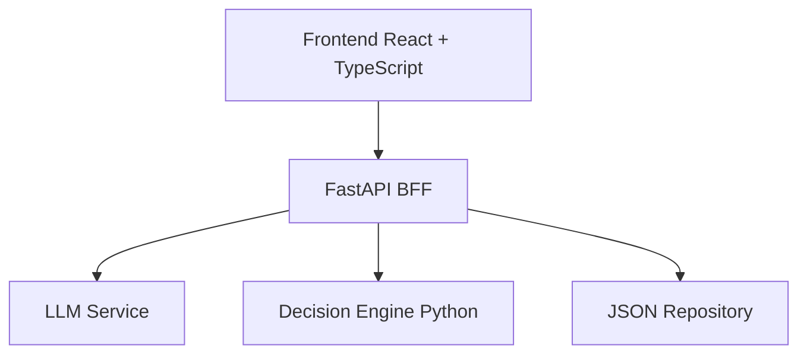

# Coordinador Simple MVP

Version simplificada del proyecto de decision grupal para un equipo de 2 desarrolladores.

La idea del MVP es simple:

1. El usuario escribe disponibilidades en lenguaje natural.
2. Un LLM convierte ese texto en JSON estructurado.
3. Un motor Python cruza horarios.
4. El sistema muestra faltantes, cobertura y explicacion de cada opcion.
5. El usuario puede corregir datos manualmente.
6. El usuario confirma una opcion.

## Arquitectura



## Carpetas

```txt
coordinador-simple-mvp/
+-- backend/
|   +-- app/
|   |   +-- main.py
|   |   +-- schemas.py
|   |   +-- bff/routes.py
|   |   +-- services/
|   |   +-- storage/
|   |   +-- prompts/
|   +-- data/sessions.json
|   +-- requirements.txt
|   +-- .env.example
+-- frontend/
|   +-- src/
|   +-- package.json
+-- docs/
```

## Ejecutar Backend

```bash
cd backend
python -m venv .venv
.venv\Scripts\activate
pip install -r requirements.txt
uvicorn app.main:app --reload --port 8000
```

Backend:

```txt
http://localhost:8000
```

## Ejecutar Frontend

```bash
cd frontend
npm install
npm run dev
```

Frontend:

```txt
http://127.0.0.1:5173
```

## LLM local recomendado

Por defecto el backend usa el proveedor local:

```txt
LLM_PROVIDER=local
LOCAL_LLM_MODEL=qwen
```

Ese modo llama al script:

```txt
C:\Users\cocan\Downloads\(Ultimos ramos)\TAVI\local_llm.py
```

Modelo recomendado para la demo:

```txt
Qwen_Qwen3-4B-Instruct-2507-Q4_K_M.gguf
```

Motivo: entiende mejor conversaciones desordenadas que los modelos chicos y es mas conveniente para extraer participantes, dias y restricciones. Si quieres comparar con Phi:

```txt
LOCAL_LLM_MODEL=phi
```

Para desarrollo rapido sin cargar modelos, puedes volver al extractor por reglas:

```txt
LLM_PROVIDER=mock
```

Para usar Gemini API, crea o edita `backend/.env` y usa:

```txt
LLM_PROVIDER=gemini
GEMINI_API_KEY=tu_api_key
GEMINI_MODEL=gemini-2.5-flash-lite
GEMINI_COOLDOWN_SECONDS=60
```

El backend llama a `generateContent`, solicita salida `application/json` y valida el resultado con el mismo esquema usado por Qwen/Ollama. Si falta la key o la API falla, vuelve al extractor `mock_fallback` para que la demo no quede inutilizable.

Para no consumir cuota de Gemini durante pruebas repetidas, usa `LLM_PROVIDER=mock` o `LLM_PROVIDER=local`. Si la API responde `429`, el backend entra en cooldown y deja de insistir por unos segundos.

Cuando Gemini responde bien, la app muestra tokens y costo aproximado de la ultima llamada y el total acumulado de la sesion. Las llamadas servidas desde cache cuentan como `0 tokens`.

Para obligar a usar Gemini real durante una prueba:

```txt
LLM_PROVIDER=gemini
GEMINI_MODEL=gemini-2.5-flash-lite
LLM_FALLBACK_ENABLED=false
LLM_CACHE_ENABLED=false
```

Para usar Ollama local:

```txt
LLM_PROVIDER=ollama
OLLAMA_MODEL=llama3.1
OLLAMA_URL=http://localhost:11434/api/chat
```

El LLM solo extrae datos desde lenguaje natural. No calcula ni confirma decisiones; eso queda en el motor Python.

La interfaz muestra el provider real activo en la tarjeta superior. Tambien puedes verlo por API:

```powershell
Invoke-RestMethod http://127.0.0.1:8000/api/runtime
```

Mas detalle: `docs/CONFIGURACION_LLM.md`.

## Rendimiento de la demo

- `Cargar conversacion ejemplo` usa un endpoint batch para enviar todos los mensajes en una sola llamada.
- Las respuestas LLM repetidas se cachean en memoria si `LLM_CACHE_ENABLED=true`.
- Si `LLM_FALLBACK_ENABLED=true` y el provider configurado falla, el backend vuelve a `mock_fallback` para no romper la demo.
- Si no existe `backend/.env`, no estas seleccionando explicitamente nube/local/mock; se usaran los defaults de `settings.py`.

## Valor visible del MVP

- Muestra que datos entendio el LLM.
- Expone participantes sin disponibilidad.
- Mantiene historial de mensajes e interpretaciones.
- Genera un mapa de disponibilidad por dia y hora.
- Permite corregir o agregar horarios manualmente.
- Calcula las 3 mejores opciones.
- Explica cobertura, asistentes y participantes que no calzan.
- Genera un resumen final al confirmar.
