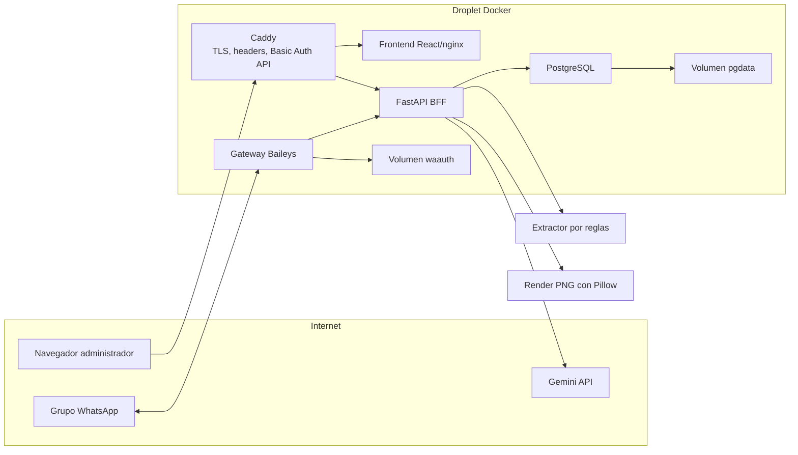
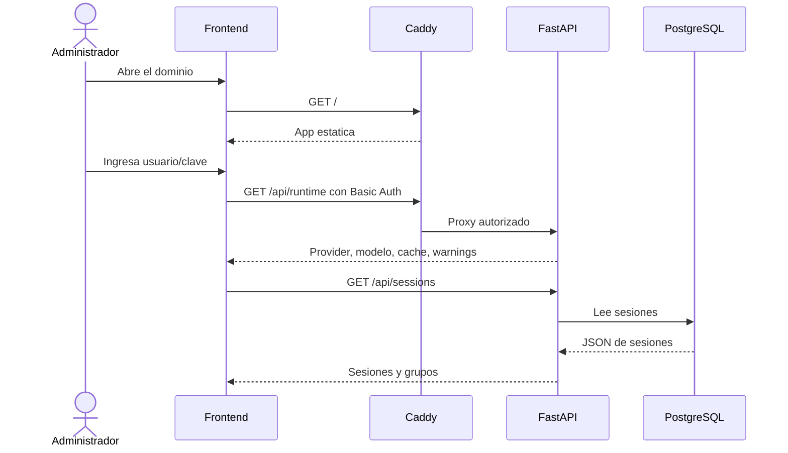
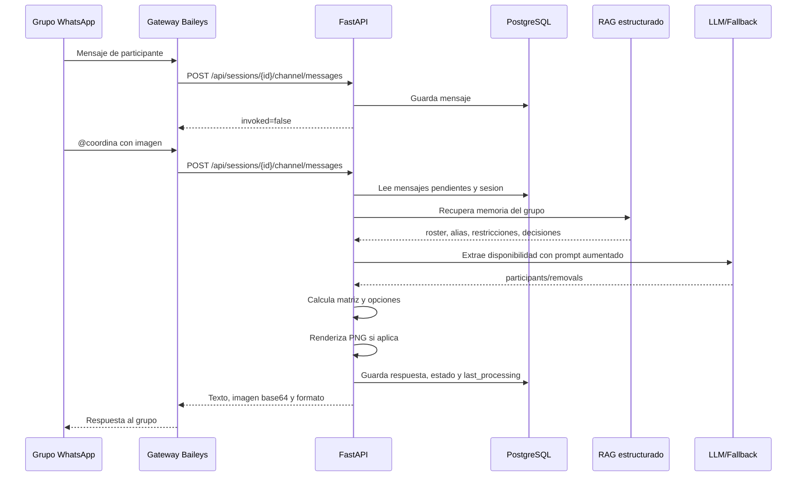
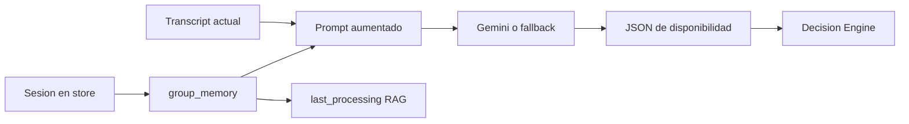

# Arquitectura

Este documento describe la arquitectura actual del MVP desplegable en un droplet.
El objetivo es mantener una solucion liviana, facil de auditar y suficiente para
pruebas reales con grupos de WhatsApp sin cargar modelos locales pesados.

## Objetivos

- Coordinar horarios desde mensajes naturales de un grupo.
- Mantener una sesion por grupo de WhatsApp.
- Permitir supervision manual desde un panel administrativo.
- Responder al grupo con texto profesional e imagen/calendario opcional.
- Mantener la API protegida y la base de datos privada.
- Seguir funcionando aunque Gemini falle, usando fallback por reglas.

## Vista De Componentes



## Responsabilidades

| Componente | Responsabilidad |
| --- | --- |
| Caddy | Publica `80/443`, TLS automatico, headers de seguridad y Basic Auth para `/api/*` y `/health`. |
| Frontend | Panel administrativo, login visual, listado de sesiones/grupos, historial, formato de respuesta e invitacion manual del bot. |
| Backend FastAPI | API, validacion de esquemas, extraccion LLM, calculo de disponibilidad, persistencia y render de imagen. |
| Gateway WhatsApp | Conecta un numero dedicado por Baileys, escucha grupos, crea/sincroniza sesiones y envia respuestas. |
| PostgreSQL | Guarda sesiones como JSONB, incluyendo participantes, historial, configuracion del canal y opciones. |
| Gemini | Extrae disponibilidad desde lenguaje natural y devuelve JSON validado. |
| Fallback por reglas | Mantiene la demo operativa ante fallas de Gemini o mensajes simples. |

## Flujo Web



Nota de seguridad: la pantalla de login vive en el frontend para mejorar la
experiencia, pero la barrera real para datos y acciones es Basic Auth en Caddy.

## Flujo WhatsApp



## RAG Estructurado

Antes de llamar al extractor LLM, el backend recupera memoria de la sesion
actual desde PostgreSQL/JSON (no hay base vectorial ni embeddings):

```txt
Session / ChannelConfig
  -> group_name, group_jid, group_participant_count
  -> participants (roster y disponibilidad activa)
  -> pistas de identidad desde channel_messages
  -> ultimas 3 entradas de decision_history
  -> bloque de prompt + fingerprint de cache
  -> last_processing.retrieval_*
```



Se denomina **RAG estructurado** porque es *retrieval-augmented generation*
sobre datos tipados del dominio, no similitud coseno. El LLM sigue siendo solo
extractor; el motor Python decide horarios.

Limites duros: 40 participantes, 30 pistas de identidad, 20 restricciones y
3 decisiones previas. El preview de trazabilidad redacts JIDs y numeros largos.

### Hora de siempre (memoria habitual)

Ademas del historial, la sesion guarda un **horario habitual** computado de
forma determinista a partir de `decision_history`: el modal de
`(day, start, end)` entre las decisiones confirmadas (empate gana la mas
reciente; umbral minimo configurable con `HABITUAL_MIN_DECISIONS`). Se recalcula
al confirmar, cancelar o reiniciar la coordinacion. Cuando un mensaje dice
"a la hora de siempre" (u otras expresiones equivalentes), el backend reescribe
la frase con el slot literal antes de llamar al LLM:

```txt
"yo no puedo a la hora de siempre"  ->  "yo no puedo el martes de 10:00 a 11:00"
```

Asi el dia y las horas ya estan "en el mensaje": el grounding temporal las
acepta y el extractor (Gemini o reglas) trabaja con datos reales. El bloque RAG
tambien expone la "hora habitual" al modelo y la trazabilidad marca
`habitual_used` en `last_processing`. Si la frase se usa sin historial, el bot
responde que aun no hay un horario habitual en lugar de inventar uno.

### Prioridades de participantes (requeridos + pesos)

Cada participante puede marcarse como **requerido** (debe estar si o si) y/o
tener un **peso de prioridad** (ej. el jefe). El motor determinista los usa:

- `weighted_score` = suma de pesos de los disponibles (peso 0 = 1, asi una
  sesion sin prioridades produce el mismo ranking que antes).
- Si existe al menos una opcion que cubre a todos los requeridos, SOLO se
  recomiendan esas; si ninguna los cubre, se muestran las mejores con
  `required_met=False` y un aviso de quienes quedan fuera.
- Confirmar una opcion que deja fuera a un requerido queda bloqueado por
  `confirmation_blockers`.
- Configuracion desde el panel o por comando de WhatsApp restringido a
  `channel_config.coordinator_ids` (los admins del grupo): `requerido @Ana`,
  `prioridad @Ana 3`, `normal @Ana`.

Plan de implementacion: [PLAN_RAG_ESTRUCTURADO.md](PLAN_RAG_ESTRUCTURADO.md).

## Sesion Por Grupo

El gateway mantiene un mapa persistido en el volumen `waauth`:

```txt
group_jid -> session_id, group_name, group_participant_count, updated_at
```

Cuando llega un mensaje de un grupo nuevo:

1. Lee metadata del grupo.
2. Crea una sesion `WhatsApp - {nombre del grupo}`.
3. Configura `group_jid`, nombre, cantidad de participantes y trigger.
4. Guarda el mapeo para futuros reinicios.

Cuando el gateway reinicia, sincroniza los grupos conocidos y enriquece sesiones
antiguas que todavia no tengan metadata.

Para estabilidad, el gateway no llama `start()` recursivamente en cada cierre.
Usa un supervisor con backoff, deduplicacion de mensajes recientes y timeout
HTTP hacia el backend. Tambien deja `fireInitQueries=false` por defecto para
evitar consultas iniciales de Baileys que no son necesarias para escuchar grupos
y que pueden generar timeouts aunque WhatsApp ya este conectado.

## Modelo De Datos

```txt
Session
  id
  schema_version
  title
  participants[]
  options[]
  availability_matrix[]
  missing_info[]
  insights[]
  messages[]
  channel_config
  channel_messages[]
  last_processing
  last_agent_reply
  selected_option
  decision_summary
  decision_history[]
  status

ChannelConfig
  listening_enabled
  trigger_word
  reply_format: text | image | both
  group_jid
  group_name
  group_participant_count

ChannelMessage
  sender
  text
  kind: human | agent
  detected_invocation
  created_at
```

## Extraccion Semantica Y Calculo

La separacion es deliberada: el modelo interpreta lenguaje, pero Python decide
los intervalos reales. Esto evita que una respuesta creativa del LLM modifique
el calendario sin pasar por validaciones deterministas.

```txt
Mensaje WhatsApp
  -> LLM/fallback: interpreta intencion semantica
  -> ScheduleEntry: available | unavailable | only
  -> schedule_compiler.py: compila a participants/removals/implied
  -> llm_service.py: normaliza nombres, grounding y overrides seguros
  -> session_service.py: fusiona, remueve, recalcula y limpia decisiones obsoletas
  -> decision_engine.py: cruza horarios por bloques de una hora
```

El extractor acepta lenguaje informal de WhatsApp, por ejemplo:

- `yo puedo lunes en la tarde`
- `estoy libre lun de 3 a 5 pm`
- `me sirve mierc 15:30-17:00`
- `no me va bien martes de 10 a 12`
- `ya no puedo ningun dia`
- `solo me queda viernes despues de las 3`
- `vuelvo de la clinica tipo 11, de ahi en adelante libre`

El motor calcula sobre dias habiles y bloques `09:00-18:00`. Rangos con minutos
se normalizan a bloques utiles para la matriz.

### Reglas Arquitectonicas Clave

- `available`: agrega disponibilidad explicita.
- `unavailable`: remueve el rango ocupado y, si es parcial, genera disponibilidad
  implicita en el complemento del dia. Ejemplo: `no puede despues de las 4` se
  transforma en remocion `16:00-18:00` e implicito `09:00-16:00`.
- `only`: representa disponibilidad exclusiva. Agrega el rango permitido y
  remueve el resto de la semana. Esto permite que una correccion como
  `Luisa solo puede viernes despues de las 3` reemplace datos viejos de Luisa.
- La disponibilidad implicita nunca expande un dia donde la persona ya habia
  declarado disponibilidad explicita mas acotada.
- Si cambia la disponibilidad despues de confirmar una opcion, la decision se
  limpia y queda pendiente de reconfirmacion.
- Si el extractor no trae datos nuevos, una decision confirmada se conserva.

### Pruebas De Arquitectura

La suite `backend/tests/test_architecture_semantic_pipeline.py` no mide el
modelo: inyecta IR semantica como si viniera del LLM y valida compilacion,
normalizacion, merge incremental, limpieza de decisiones obsoletas y calculo.

La sonda `tools/probe_local_architecture.py` usa un modelo local real como
entrada, pero evalua el sistema completo:

```powershell
& "C:\Users\cocan\Downloads\(Ultimos ramos)\TAVI\.venv\Scripts\python.exe" tools\probe_local_architecture.py --model qwen --timeout 240 --out data\local_architecture_probe.json
```

Ultima validacion local:

| Escenario | Resultado | Que protege |
| --- | --- | --- |
| `incremental_hard_group` | PASS | Excepciones, topes, turnos, `solo me queda`, retorno de clinica y ranking de opciones. |
| `correction_after_confirmation` | PASS | Una correccion posterior limpia la decision confirmada y recalcula. |

## Seguridad

- Solo Caddy expone puertos publicos `80/443`.
- Backend, PostgreSQL y gateway no tienen puertos publicados al exterior.
- `/api/*` y `/health` requieren Basic Auth configurado con hash bcrypt de Caddy.
- `.env.prod`, `keys/`, `pgdata` y `waauth` no deben subirse al repositorio.
- El frontend guarda las credenciales en `sessionStorage`, no en `localStorage`.
- La API valida longitudes de mensajes y nombres antes de procesar.
- Prompt injection y mensajes fuera de dominio se cubren con prompt, grounding y tests.

Limitacion importante: Baileys automatiza WhatsApp Web de forma no oficial. Para
una prueba controlada sirve; para producto comercial habria que evaluar otro
canal o aceptar que la API oficial de WhatsApp no soporta grupos.

## Rendimiento Y Recursos

La arquitectura evita correr un LLM local en el droplet. En produccion, el peso
principal es:

- Backend FastAPI + Pillow: bajo consumo.
- Gateway Node/Baileys: bajo consumo, depende de la sesion WhatsApp.
- PostgreSQL: persistencia principal.
- Gemini remoto: costo por tokens, sin carga de CPU/RAM local.

Controles ya presentes:

- Cache LLM en memoria.
- Cooldown cuando Gemini responde `429` o `503`.
- Fallback por reglas si esta activado.
- Imagen opcional; si falla el render, no rompe la respuesta del canal.

## Endpoints Principales

| Metodo | Ruta | Uso |
| --- | --- | --- |
| GET | `/health` | Salud del backend, protegido en produccion. |
| GET | `/api/runtime` | Provider, modelo, cache, fallback y warnings. |
| GET | `/api/sessions` | Lista sesiones recientes. |
| POST | `/api/sessions` | Crea sesion manual o desde gateway. |
| GET | `/api/sessions/{id}` | Lee sesion completa. |
| POST | `/api/sessions/{id}/message` | Extrae disponibilidad desde texto manual. |
| POST | `/api/sessions/{id}/participants` | Agrega participante. |
| POST | `/api/sessions/{id}/availability` | Agrega disponibilidad manual. |
| POST | `/api/sessions/{id}/calculate` | Recalcula opciones. |
| POST | `/api/sessions/{id}/confirm` | Confirma una opcion. |
| PATCH | `/api/sessions/{id}/channel/config` | Configura canal, grupo y formato de respuesta. |
| POST | `/api/sessions/{id}/channel/messages` | Ingesta un mensaje de WhatsApp/canal. |
| POST | `/api/sessions/{id}/channel/batch` | Simula varios mensajes en una llamada. |

## Decisiones De Arquitectura

| Decision | Motivo |
| --- | --- |
| Caddy delante de todo | TLS automatico, headers, proxy y auth sin tocar la app. |
| Backend sin puerto publico | Reduce superficie de ataque. |
| Sesiones como JSONB | Evoluciona rapido sin migraciones complejas para el MVP. |
| Una sesion por grupo | Hace simple auditar historial y estado por canal real. |
| Gemini Flash-Lite | Buen balance para extraccion corta y costo bajo. |
| Fallback por reglas | Mantiene la demo usable ante cuotas, errores o latencia externa. |
| Imagen generada en backend | El gateway solo envia bytes; la logica visual queda centralizada. |

## Evolucion Recomendada

1. Mover Basic Auth a usuarios reales si habra mas administradores.
2. Agregar auditoria de acciones administrativas.
3. Crear migraciones formales si el esquema deja de ser flexible.
4. Agregar rate limiting en Caddy o backend.
5. Separar entornos `staging` y `production`.
6. Evaluar `gemini-2.5-flash` solo si la calidad de extraccion lo exige.
