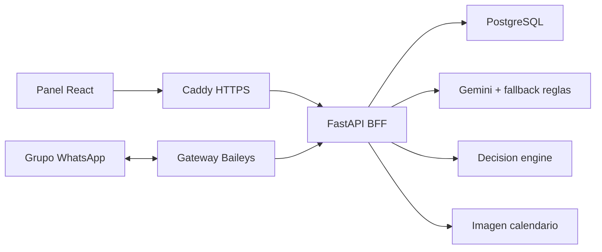

# Arquitectura Simple

Resumen corto de la arquitectura. Para la version completa y operativa, usa
[ARQUITECTURA.md](ARQUITECTURA.md).



## Idea Central

```txt
WhatsApp y frontend capturan mensajes.
RAG estructurado recupera memoria del grupo.
LLM/fallback extraen disponibilidad.
Python calcula opciones.
PostgreSQL guarda sesiones e historial.
Caddy protege y publica el sistema.
```

## Flujo Minimo

1. El bot recibe mensajes en un grupo de WhatsApp.
2. El gateway crea o reutiliza la sesion asociada al grupo.
3. El backend guarda mensajes humanos hasta que aparece `@coordina`.
4. El LLM extrae participantes, disponibilidades y remociones.
5. El motor cruza horarios por bloques de una hora.
6. El backend genera respuesta de texto y, si corresponde, imagen del calendario.
7. El gateway responde al grupo.
8. El administrador revisa sesiones, historial y formato de respuesta desde el panel.

## Componentes

| Componente | Rol |
| --- | --- |
| `frontend/` | Panel administrativo y login visual. |
| `backend/` | API, extraccion, calculo, persistencia y render de imagen. |
| `gateway/` | Conexion WhatsApp y puente al backend. |
| `db` | PostgreSQL interno. |
| `caddy` | TLS, proxy y headers; FastAPI valida cuentas y roles. |

## Regla De Diseno

```txt
El LLM no decide horarios.
El motor Python no interpreta lenguaje natural.
El administrador puede corregir el estado cuando el canal sea ambiguo.
```
