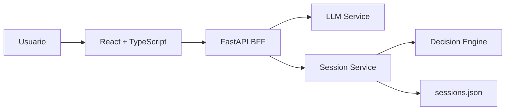
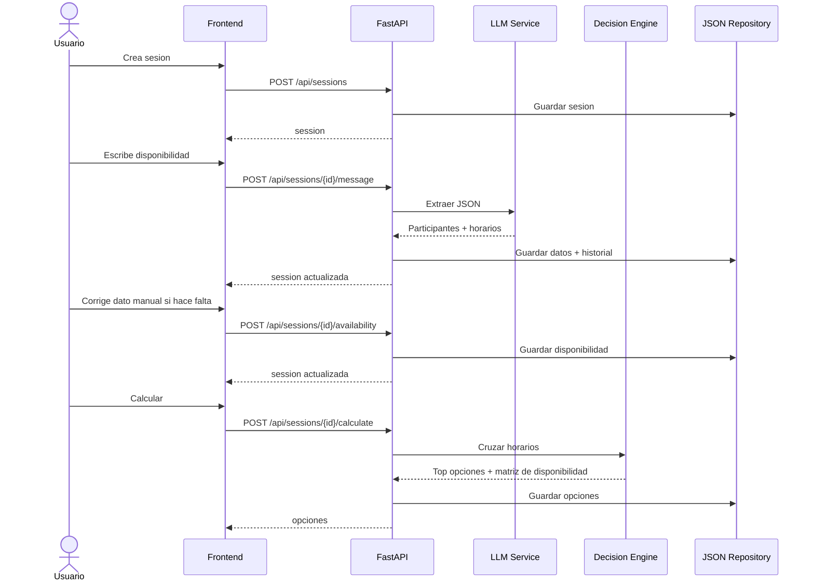

# Arquitectura simple

## Vista general



## Secuencia principal



## Endpoints

| Metodo | Ruta | Uso |
| --- | --- | --- |
| GET | `/health` | Verificar backend. |
| POST | `/api/sessions` | Crear sesion. |
| GET | `/api/sessions/{id}` | Obtener sesion. |
| POST | `/api/sessions/{id}/message` | Extraer disponibilidad con LLM. |
| POST | `/api/sessions/{id}/participants` | Agregar participante manualmente. |
| POST | `/api/sessions/{id}/availability` | Agregar disponibilidad manual. |
| POST | `/api/sessions/{id}/calculate` | Calcular mejores horarios. |
| POST | `/api/sessions/{id}/confirm` | Confirmar opcion. |

## Modelo minimo

```txt
Session
  id
  title
  participants
  options
  availability_matrix
  missing_info
  insights
  messages
  selected_option
  decision_summary
  status

Participant
  id
  name
  availability

TimeSlot
  day
  start
  end

TimeOption
  id
  day
  start
  end
  available_participants
  unavailable_participants
  score
  coverage_percent
  explanation

AvailabilityCell
  day
  start
  end
  available_participants
  unavailable_participants
  score
  coverage_percent

ChatMessage
  role
  content
  source
  created_at
```
