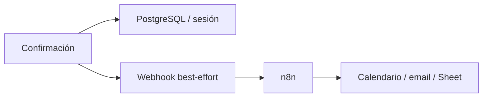

# Plan 2 — n8n / webhooks post-confirmación (aplazado)

Objetivo: completar el **ecosistema** con automatización externa después de
confirmar un horario (calendario, email, hoja de cálculo, etc.).

Estado: **aplazado**. No implementar mientras se trabaja el Plan 1 (RAG).

Documento hermano (activo): [PLAN_RAG_ESTRUCTURADO.md](PLAN_RAG_ESTRUCTURADO.md).

---

## 1. Por qué está separado del RAG

| Plan 1 (RAG) | Plan 2 (n8n) |
|--------------|--------------|
| Mejora la capa **LLM** | Mejora **integraciones post-decisión** |
| Técnica prioritaria de la rúbrica | Ecosistema complementario |
| Se implementa **ahora** | Se implementa **después**, si hace falta |

n8n **no** debe reescribir el flujo WhatsApp → extracción → motor de horarios.
Solo reacciona a un evento de negocio ya confirmado.

---

## 2. Alcance (cuando se reactive)

### En alcance

- Webhook HTTP al confirmar una opción (`session.confirmed`)
- Payload JSON estable y documentado
- Fallo del webhook **sin** revertir la confirmación
- Flujo de ejemplo en n8n (Calendar / email / Sheet)
- Settings por variables de entorno (sin secretos en el repo)
- Tests con mock de red

### Fuera de alcance

- Orquestar Baileys, cola de mensajes o el decision engine en n8n
- Sustituir el export `.ics` existente (puede convivir)
- Exigir n8n instalado en el droplet de producción
- RAG / cambios al prompt del LLM

---

## 3. Flujo objetivo

```txt
Usuario confirma opción
  → session_service.confirm(...) persiste decisión
  → emit_session_confirmed(session)   ← best-effort
  → POST WEBHOOK_CONFIRM_URL
  → n8n: Calendar / email / Sheet / Slack
```



---

## 4. Payload mínimo sugerido

```json
{
  "event": "session.confirmed",
  "session_id": "...",
  "group_jid": "...",
  "group_name": "...",
  "option": {
    "day": "martes",
    "start": "15:00",
    "end": "16:00",
    "week_offset": 0,
    "coverage_percent": 80,
    "available_participants": ["Ana", "Luis"]
  },
  "event_date": "2026-07-28",
  "confirmed_by": "admin",
  "source": "whatsapp",
  "summary": "..."
}
```

Opcional: header `X-Coordina-Signature` o `Authorization` con secret compartido.

---

## 5. Archivos a tocar (futuro)

| Archivo | Cambio |
|---------|--------|
| `backend/app/settings.py` | `webhook_confirm_url`, `webhook_confirm_secret` (opcional) |
| `backend/app/services/webhooks.py` | **Nuevo**: `emit_session_confirmed(session)` |
| `backend/app/services/session_service.py` | Llamar emit al final de `confirm` |
| `backend/.env.example` / `.env.prod.example` | Documentar variables (sin valores secretos) |
| `backend/tests/test_webhooks.py` | Mock HTTP: con/sin URL, fallo no revierte |
| `docs/DESPLIEGUE_WHATSAPP.md` o doc corto | Cómo enganchar n8n |

**No tocar para este plan:** `llm_service.py`, `decision_engine.py`, prompt de
extracción, gateway (salvo que se quiera loguear el evento).

---

## 6. Settings sugeridos

```txt
WEBHOOK_CONFIRM_URL=
WEBHOOK_CONFIRM_SECRET=
WEBHOOK_CONFIRM_TIMEOUT_SECONDS=5
WEBHOOK_CONFIRM_ENABLED=false
```

Reglas:

- Si la URL está vacía o `ENABLED=false` → no hay red.
- Timeout corto; errores solo a log/warning.
- Nunca bloquear la respuesta al usuario de WhatsApp por n8n lento.

Implementación recomendada: fire-and-forget en thread/`asyncio` o POST síncrono
muy acotado con try/except; priorizar no degradar latencia del canal.

---

## 7. Flujo n8n de ejemplo (manual)

1. Trigger: **Webhook** (método POST, path propio).
2. (Opcional) Validar secret en header.
3. Nodo de acción, uno de:
   - Google Calendar → Create event
   - Email / Gmail
   - Google Sheets → Append row
   - Slack / Discord notification
4. Mapear campos del payload (`event_date`, `option.start`, `group_name`, etc.).
5. Capturar screenshot del canvas para el informe/defensa.

n8n puede correr en:

- laptop del grupo (demo controlada), o
- instancia aparte; no es obligatorio co-ubicarla con el droplet del MVP.

---

## 8. Tests (cuando se implemente)

| Test | Valida |
|------|--------|
| `test_confirm_without_webhook_url` | No llama red |
| `test_confirm_with_webhook` | POST con payload esperado (mock) |
| `test_webhook_failure_does_not_rollback` | Sesión queda `confirmed` aunque falle el POST |
| `test_webhook_disabled_flag` | `ENABLED=false` ignora URL |

---

## 9. Orden de implementación (futuro)

| Paso | Trabajo |
|------|---------|
| 1 | Settings + `webhooks.py` + tests unitarios del emisor |
| 2 | Enganche en `session_service.confirm` |
| 3 | Suite pytest (confirmaciones existentes no se rompen) |
| 4 | Flujo n8n de demo + screenshot |
| 5 | Documentar variables y payload |

**Estimación:** 0.5–1 día.

---

## 10. Criterios de “listo”

- [ ] Confirmación emite webhook solo si hay URL y está habilitado
- [ ] Fallo webhook no rompe ni revierte confirmación
- [ ] Payload documentado y estable
- [ ] Tests con mock de red en verde
- [ ] Screenshot o video de n8n para el informe (si se usa en defensa)

---

## 11. Texto corto para el informe (cuando aplique)

> Tras la confirmación humana de un horario, el backend emite un evento
> `session.confirmed` hacia un webhook configurable. Herramientas de
> automatización como n8n pueden reaccionar a ese evento para crear entradas de
> calendario o notificaciones, sin intervenir en la interpretación del lenguaje
> ni en el cálculo de disponibilidad. Así se separa la inteligencia de
> coordinación (LLM + motor) de la integración organizacional.

---

## 12. Relación con el resto del sistema

```txt
WhatsApp / panel
  → LLM (+ RAG, Plan 1)
  → Decision Engine
  → Confirmación humana
  → [Plan 2] Webhook → n8n → sistemas externos
```

Dependencia: el Plan 2 **no requiere** el Plan 1 para funcionar, y el Plan 1
**no requiere** el Plan 2. Se pueden entregar por separado.
