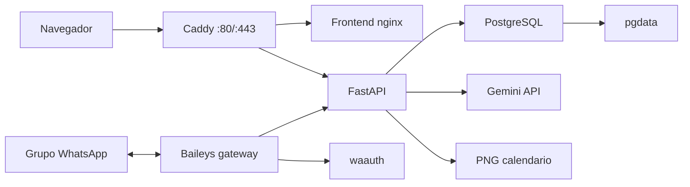

# Despliegue En Droplet Con WhatsApp

Runbook para servir el panel en un dominio publico y conectar un numero dedicado
de WhatsApp como bot de grupo.

> Aviso: el gateway usa Baileys, que automatiza WhatsApp Web de forma no oficial.
> Usalo con un numero dedicado para demos y pruebas controladas. No uses tu numero
> personal ni prometas disponibilidad de producto comercial sobre esta via.

## Arquitectura De Produccion



## Requisitos

- Droplet Ubuntu con Docker y Docker Compose.
- Dominio o subdominio apuntando al droplet.
- Puertos `80` y `443` abiertos.
- API key de Gemini o `LLM_PROVIDER=mock` para pruebas sin IA.
- Numero dedicado con WhatsApp para escanear el QR.
- Claves fuertes para Postgres y Basic Auth.

Recursos recomendados para este MVP:

```txt
1-2 vCPU
1-2 GB RAM
Docker + swap razonable si el droplet es pequeno
```

No se corre un LLM local en el droplet; Gemini corre en la nube.

## DNS

Ejemplo usado en produccion:

```txt
Tipo: A
Nombre: coordina
Valor: 161.35.17.179
TTL: 14400
```

Resultado:

```txt
coordina.xshift007.com -> 161.35.17.179
```

Validar:

```powershell
nslookup coordina.xshift007.com
```

## Archivo `.env.prod`

Crear desde el ejemplo:

```bash
cd /opt/coordinador-simple-mvp
cp .env.prod.example .env.prod
nano .env.prod
```

Variables principales:

```txt
PUBLIC_DOMAIN=coordina.xshift007.com
PUBLIC_URL=https://coordina.xshift007.com

BASIC_AUTH_USER=coordina
BASIC_AUTH_HASH=...

POSTGRES_USER=postgres
POSTGRES_PASSWORD=...
POSTGRES_DB=meetingdb

LLM_PROVIDER=gemini
GEMINI_API_KEY=...
GEMINI_MODEL=gemini-2.5-flash-lite

TRIGGER_WORD=@coordina
LOG_LEVEL=info
BOT_PHONE_NUMBER=+56...
```

Generar hash para Caddy:

```bash
docker run --rm caddy:2 caddy hash-password --plaintext "tu_password"
```

No imprimas ni pegues `.env.prod` en chats. El archivo contiene secretos.

## Levantar Produccion

```bash
cd /opt/coordinador-simple-mvp
docker compose -f docker-compose.prod.yml --env-file .env.prod up -d --build
```

Ver estado:

```bash
docker compose -f docker-compose.prod.yml --env-file .env.prod ps
```

Servicios esperados:

```txt
db        PostgreSQL privado
backend   FastAPI privado
frontend  nginx interno
gateway   Baileys sin puerto publico
caddy     unico servicio con 80/443 publicados
```

## Vincular WhatsApp

Ver QR:

```bash
docker compose -f docker-compose.prod.yml --env-file .env.prod logs -f gateway
```

En el telefono del numero dedicado:

```txt
WhatsApp -> Dispositivos vinculados -> Vincular un dispositivo
```

Escanea el QR. Cuando el log diga que el gateway esta conectado, la sesion queda
persistida en el volumen `waauth` y no deberia requerir QR en cada reinicio.

## Agregar El Bot A Un Grupo

Para pruebas, el administrador lo hace manualmente:

1. Crea o abre el grupo de WhatsApp.
2. Agrega el numero dedicado del bot al grupo.
3. El bot se presenta solo con un mensaje de bienvenida y crea la sesion.
4. Los participantes escriben disponibilidad normalmente.
5. Alguien invoca al bot con `@coordina`.

Ejemplos de mensajes entendidos:

```txt
yo puedo lunes en la tarde
estoy libre lun de 3 a 5 pm
me sirve mierc 15:30-17:00
no me va bien martes de 10 a 12
@coordina con imagen
```

El panel web tambien ofrece un flujo para armar un mensaje de invitacion hacia
el administrador, pero por ahora el ingreso del bot al grupo es manual.

## Sesiones Automaticas Por Grupo

El gateway crea una sesion nueva cuando ve un `group_jid` desconocido. Guarda el
mapeo en:

```txt
volumen waauth / group-sessions.json
```

El backend recibe metadata del grupo:

```txt
group_jid
group_name
group_participant_count
```

El panel muestra esas sesiones como grupos reales, separadas de pruebas manuales.

## Formato De Respuesta

El canal soporta:

```txt
text   -> solo mensaje
image  -> solo imagen con caption
both   -> texto + imagen
```

El default se guarda en `channel_config.reply_format`. La invocacion puede
sobrescribirlo:

```txt
@coordina solo texto
@coordina solo imagen
@coordina con imagen
```

Si el render de imagen falla, el backend sigue respondiendo con texto.

## Comandos Del Canal

Ademas de proponer horarios, el bot entiende comandos dentro del grupo:

```txt
@coordina ayuda            -> lista lo que entiende y los comandos
@coordina confirma         -> cierra la decision con la mejor opcion
@coordina confirma 2       -> cierra con la opcion numero 2
@coordina cancela          -> deshace la decision confirmada
@coordina resumen          -> estado actual y opciones
@coordina faltan           -> quienes no han dado su horario
@coordina exportar         -> reporte de la sesion en texto
@coordina quita a <nombre> -> elimina un participante
```

Al confirmar, el bot envia al grupo el mensaje de decision con la fecha
concreta ("Lunes 13 de julio"), un link directo *Agregar a Google Calendar*
(clickeable desde WhatsApp) y un archivo `.ics` para Outlook/Apple.

Las propuestas tambien muestran la fecha real de cada opcion ("Lunes 13/07")
y la imagen incluye las fechas en los encabezados de cada dia.

Antes de ejecutar cualquier comando, el bot procesa la disponibilidad
pendiente escrita desde su ultima respuesta, asi "confirma" y "resumen"
siempre operan con datos al dia.

## Validaciones Despues De Desplegar

Desde una maquina externa:

```powershell
$pair = "usuario:password"
$basic = [Convert]::ToBase64String([Text.Encoding]::ASCII.GetBytes($pair))
$headers = @{ Authorization = "Basic $basic" }

Invoke-RestMethod https://coordina.xshift007.com/api/runtime -Headers $headers
Invoke-RestMethod https://coordina.xshift007.com/health -Headers $headers
```

Sin credenciales:

```powershell
curl.exe -s -o NUL -w "%{http_code}" https://coordina.xshift007.com/api/runtime
curl.exe -s -o NUL -w "%{http_code}" https://coordina.xshift007.com/.env
```

Esperado:

```txt
/api/runtime sin auth -> 401
/.env -> 404
/health con auth -> ok=true
```

En el droplet:

```bash
docker stats --no-stream
docker compose -f docker-compose.prod.yml --env-file .env.prod logs --tail 80 backend
docker compose -f docker-compose.prod.yml --env-file .env.prod logs --tail 80 gateway
```

## Actualizar Codigo

Respaldo consistente antes de tocar produccion:

```bash
/usr/local/sbin/tavi-coordina-backup
```

Este comando respalda PostgreSQL y el volumen `waauth`, valida ambos contenidos
y cifra el resultado sin incluir `.env.prod`. La descarga y verificacion fuera
del droplet se ejecutan desde Windows con:

```powershell
.\ops\pull_encrypted_backup.ps1
```

Procedimiento completo: [BACKUP_RECOVERY.md](BACKUP_RECOVERY.md).

Rebuild completo:

```bash
docker compose -f docker-compose.prod.yml --env-file .env.prod up -d --build
```

Solo backend:

```bash
docker compose -f docker-compose.prod.yml --env-file .env.prod up -d --build backend
```

Solo frontend:

```bash
docker compose -f docker-compose.prod.yml --env-file .env.prod up -d --build frontend
```

Solo gateway:

```bash
docker compose -f docker-compose.prod.yml --env-file .env.prod up -d --build gateway
```

## Gateway Resiliente

El gateway usa un supervisor liviano sobre Baileys:

- Mantiene una sola conexion activa.
- Reconecta con backoff exponencial si WhatsApp cierra el socket.
- Deduplica mensajes recientes para reducir respuestas repetidas tras reconexion.
- Corta llamadas HTTP al backend con timeout.
- Desactiva `fireInitQueries` por defecto porque para este bot no necesitamos que
  Baileys cargue propiedades/privacidad/bloqueos al iniciar; esas consultas eran
  la fuente del timeout `unexpected error in 'init queries'`.

Variables opcionales:

```txt
API_TIMEOUT_MS=30000
WA_CONNECT_TIMEOUT_MS=60000
WA_KEEP_ALIVE_MS=30000
WA_RECONNECT_MIN_MS=2000
WA_RECONNECT_MAX_MS=60000
WA_GROUP_SYNC_INTERVAL_MS=300000
WA_FIRE_INIT_QUERIES=false
GATEWAY_HEARTBEAT_INTERVAL_MS=600000
RECENT_MESSAGE_LIMIT=500
```

Si necesitas diagnosticar funciones internas de Baileys, puedes probar
`WA_FIRE_INIT_QUERIES=true`, pero para la demo normal conviene dejarlo en `false`.

## Seguridad Operativa

- No publiques `8000`, `5432` ni puertos del gateway.
- Manten `.env.prod`, `keys/`, `pgdata` y `waauth` fuera de git.
- Cambia la clave de Basic Auth si se compartio por error.
- Usa un numero de WhatsApp dedicado.
- Manten `LLM_FALLBACK_ENABLED=true` para demos, salvo pruebas donde quieras fallar fuerte.
- Revisa logs si hay respuestas raras antes de culpar al frontend.

## Problemas Comunes

### No aparece QR

```bash
docker compose -f docker-compose.prod.yml --env-file .env.prod logs -f gateway
```

Si la sesion quedo corrupta o cerrada:

```bash
docker compose -f docker-compose.prod.yml --env-file .env.prod down
docker volume rm coordinador-simple-mvp_waauth
docker compose -f docker-compose.prod.yml --env-file .env.prod up -d gateway
```

Esto obliga a escanear QR nuevamente.

### El bot no responde

Revisar:

- El numero del bot esta dentro del grupo.
- El mensaje contiene el trigger configurado, por ejemplo `@coordina`.
- El gateway esta conectado.
- El backend responde `/health`.
- No hay errores en `logs gateway` o `logs backend`.

### Gemini responde 429 o 503

El backend entra en cooldown. Si `LLM_FALLBACK_ENABLED=true`, usara reglas para
mantener la demo operativa. Revisa cuota, billing y frecuencia de llamadas.

### El panel carga pero no muestra datos

Verifica credenciales de Basic Auth y CORS:

```bash
docker compose -f docker-compose.prod.yml --env-file .env.prod logs --tail 80 caddy
docker compose -f docker-compose.prod.yml --env-file .env.prod logs --tail 80 backend
```
