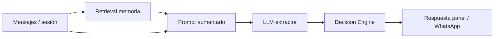

# Plan 1 — RAG estructurado (activo)

Objetivo: demostrar **LLM + RAG** de forma útil y defendible, sin n8n, sin
fine-tuning y sin tocar el motor de decisión.

Estado: **implementado** (ver `backend/app/services/group_memory.py` y tests).

Documento hermano (aplazado): [PLAN_N8N_WEBHOOKS.md](PLAN_N8N_WEBHOOKS.md).

---

## 1. Alcance

### En alcance

| Ítem | Descripción |
|------|-------------|
| Retrieval | Recuperar memoria del grupo/sesión desde el store actual |
| Augmentation | Inyectar esa memoria en el prompt de extracción |
| Trazabilidad | Exponer en `last_processing` / API que se usó retrieval |
| Tests | Unitarios + regresión de la suite backend |
| Docs / informe | Párrafo y diagrama del flujo RAG |

### Fuera de alcance (este plan)

- n8n / webhooks de confirmación (ver Plan 2)
- Vector DB, embeddings, LangChain
- Fine-tuning, MCP, Knowledge Graph formal
- Cambios a Baileys, Caddy o `decision_engine`
- Despliegue a producción (solo local hasta validar)

### Principio fijo

```txt
Retrieval  →  memoria del grupo
LLM        →  solo extracción JSON
Python     →  ranking / cobertura / confirmación
```

---

## 2. Flujo objetivo

```txt
Session (+ group_jid)
  → build_group_memory_context(session)      ← retrieval
  → transcript de mensajes de la ronda
  → build_extraction_prompt(..., memory=...) ← augmentation
  → Gemini / fallback
  → normalize_channel_extraction
  → decision_engine                          ← sin cambios
  → last_processing con datos de retrieval   ← demo
```



---

## 3. Qué se recupera

Fuentes ya existentes en `Session` / `ChannelConfig` (sin tabla nueva
obligatoria):

| Bloque | Fuente | Límite |
|--------|--------|--------|
| Grupo | `group_name`, `group_jid` | 1 |
| Roster | `participants[].name` (+ `external_id` si hay) | ≤ 40 |
| Identidad / alias | senders y aliases de `channel_messages` | ≤ 30 pistas |
| Restricciones de la ronda | disponibilidad ya consolidada en participantes | ≤ 20 líneas |
| Decisiones previas | `decision_history` (más recientes) | **últimas 3** |
| Tamaño de grupo | `group_participant_count` | 1 |

**No** volcar todo el historial de chat: el transcript de la ronda activa ya se
arma aparte.

---

## 4. Contrato de datos

```python
class GroupMemoryContext(BaseModel):
    group_name: str | None = None
    group_jid: str | None = None
    known_participants: list[str] = []
    identity_hints: list[str] = []
    known_constraints_summary: list[str] = []
    past_decisions: list[str] = []
    expected_group_size: int | None = None
    retrieved_at: str
    source: str = "session_store"
```

Bloque de prompt (reglas anti-alucinación):

```txt
## Memoria recuperada del grupo (RAG estructurado)
- Grupo: ...
- Participantes conocidos: ...
- Pistas de identidad: ...
- Restricciones ya registradas en esta ronda: ...
- Decisiones previas del grupo: ...

Usa esta memoria solo para desambiguar nombres e interpretar el texto.
NO inventes disponibilidad que no esté en el texto a analizar.
NO copies decisiones previas como disponibilidad actual salvo que el texto lo confirme.
```

---

## 5. Archivos a tocar

| Archivo | Cambio |
|---------|--------|
| `backend/app/services/group_memory.py` | **Nuevo**: build + format del contexto |
| `backend/app/services/llm_service.py` | Prompt + `extract_*` aceptan memoria; cache key incluye fingerprint de memoria |
| `backend/app/bff/routes.py` | Call sites de extracción (canal y panel) pasan `group_memory` |
| `backend/app/schemas.py` | Campos de retrieval en `ProcessingSummary` |
| `backend/app/services/session_service.py` | Solo si ahí se arma `last_processing` |
| `frontend/...` | Opcional: mostrar badge RAG en `last_processing` |
| `backend/tests/...` | Tests de memoria, prompt, cache, integración mock |
| `docs/ARQUITECTURA.md` o `CONFIGURACION_LLM.md` | Sección corta RAG |

**No tocar:** `decision_engine.py`, `gateway/`, Docker prod, n8n.

---

## 6. Enganche técnico

### Firmas sugeridas

```python
def build_group_memory_context(session: Session, ...) -> GroupMemoryContext: ...
def format_group_memory_for_prompt(memory: GroupMemoryContext) -> str: ...

def build_extraction_prompt(
    message: str,
    ...,
    group_memory: str | None = None,
) -> str: ...

def extract_channel_availability(
    self,
    messages: list[ChannelMessage],
    ...,
    group_memory: GroupMemoryContext | None = None,
) -> tuple[...]: ...
```

### Orden del prompt

1. Reglas de extracción (`EXTRACTION_PROMPT`)
2. Ventana horaria
3. Contexto temporal (ya existe)
4. **Memoria RAG**
5. Texto a analizar
6. “solo JSON”

### Cache

```txt
cache_key = hash(message, workday, date, memory_fingerprint)
```

### Call sites

- Extracción por canal WhatsApp en `routes.py`
- Extracción por mensaje de panel/API en `routes.py`

```python
memory = build_group_memory_context(session)
extraction, source, tokens = llm_service.extract_channel_availability(
    messages, start, end, group_memory=memory,
)
# rellenar last_processing.retrieval_*
```

---

## 7. Trazabilidad (demo)

Extender `ProcessingSummary`:

```python
retrieval_used: bool = False
retrieval_source: str | None = None
retrieval_participant_count: int = 0
retrieval_past_decision_count: int = 0
retrieval_preview: str = ""
```

Mínimo para defensa: campos visibles en respuesta API.
UI en panel: opcional.

---

## 8. Tests

| Test | Valida |
|------|--------|
| `test_group_memory_empty_session` | Sesión vacía estable |
| `test_group_memory_includes_roster_and_decisions` | Roster + top 3 decisiones |
| `test_group_memory_limits` | Caps de tamaño |
| `test_build_extraction_prompt_includes_memory` | Bloque en prompt |
| `test_cache_key_changes_with_memory` | Cache no mezcla memorias |
| `test_extract_channel_with_memory_mock` | Pipeline mock OK |

Suite completa:

```powershell
cd backend
pytest -q
```

Priorizar no romper: semantic extraction, channel simulator, mention identity,
API integration, confirmation regressions.

---

## 9. Orden de implementación

| Paso | Trabajo |
|------|---------|
| 1 | `group_memory.py` + tests unitarios de retrieval |
| 2 | Integrar en `build_extraction_prompt` + cache key |
| 3 | Enganchar `routes.py` / `extract_channel_availability` |
| 4 | `ProcessingSummary` + relleno en flujo real |
| 5 | Suite pytest + fix regresiones |
| 6 | Docs + párrafo informe + guion demo |

**Estimación:** 1–2 días.

---

## 10. Criterios de “listo”

- [ ] Con roster + `decision_history`, el prompt incluye el bloque de memoria
- [ ] Sesión vacía sigue funcionando
- [ ] API / `last_processing` expone `retrieval_used`
- [ ] Cache distingue memorias distintas
- [ ] Backend tests en verde
- [ ] `decision_engine` sin cambios de semántica
- [ ] Demo local: mensaje con apodo o continuidad de grupo + preview de retrieval

---

## 11. Texto corto para el informe

> El sistema usa un LLM (Gemini) como extractor semántico de disponibilidad.
> Para desambiguar participantes y dar continuidad entre coordinaciones del
> mismo grupo se incorpora **RAG estructurado**: antes de generar se recuperan
> desde el almacén de sesiones el roster, pistas de identidad y las últimas
> decisiones del grupo, y ese contexto aumenta el prompt. La elección del
> horario permanece en un motor determinista en Python; el LLM no decide la
> reunión.

---

## 12. Guion de demo

1. Sesión con participantes y al menos 1 decisión en historial.
2. Mensaje ambiguo (“yo” / apodo / mención).
3. Mostrar `retrieval_used=true` y preview.
4. Mostrar extracción + opciones con cobertura.
5. Explicar: memoria recuperada → LLM interpreta → motor decide.

---

## 13. Producción (después de local, no día 1)

1. Validar local + tests.
2. Backup / health del droplet.
3. Desplegar backend (y frontend solo si hubo UI de preview).
4. No reiniciar gateway si no cambió su imagen.
5. Verificar un extract en grupo de prueba y `last_processing`.

---

## 14. Riesgos y mitigaciones

| Riesgo | Mitigación |
|--------|------------|
| Prompt demasiado largo / caro | Caps duros (3 decisiones, 40 nombres, 20 constraints) |
| El modelo “reusa” horarios viejos | Instrucciones explícitas en el bloque memoria + tests |
| Romper sesiones antiguas en DB | Campos nuevos con defaults Pydantic |
| Sobreclaim de “RAG vectorial” | En informe: **RAG estructurado / retrieval por sesión y grupo** |
